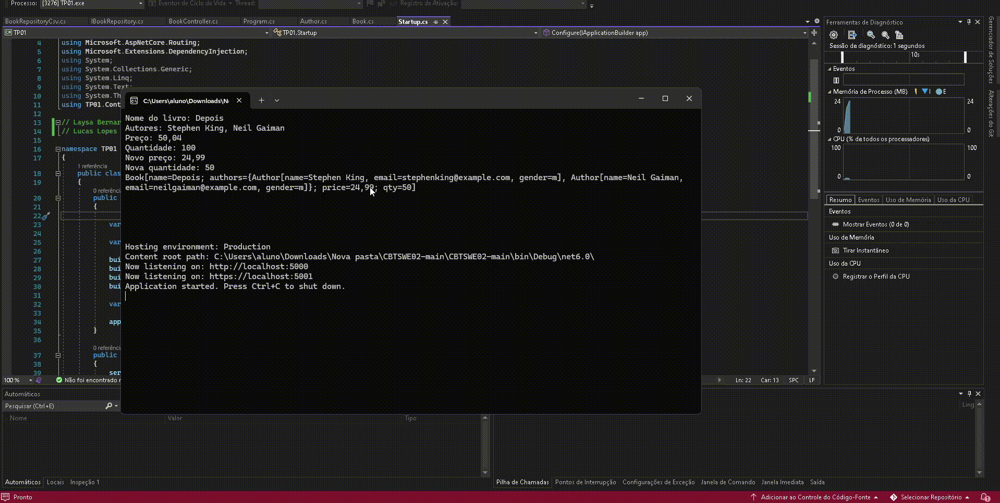

# Trabalho Prático 01: 
Atividade consiste em um sistema simples para gerenciar e exibir informações sobre livros.  

## ✨ Rotas:
- `/livro/nome` → retorna o nome do livro.  
- `/livro` → retorna todas as informações do livro.  
- `/livro/autores` → retorna os nomes dos autores.  
- `/livro/ApresentarLivro` → retorna uma página HTML com título e lista de autores.

## ✨ Teste

## ✒️ Autores

-  **Laysa Bernardes - CB3024873** 
-  **Lucas Lopes - CB3025284**
